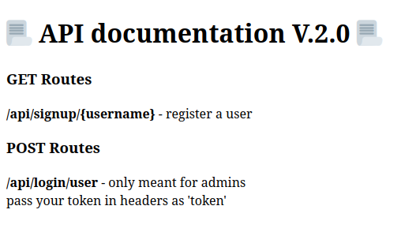
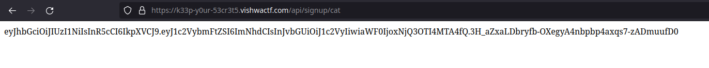
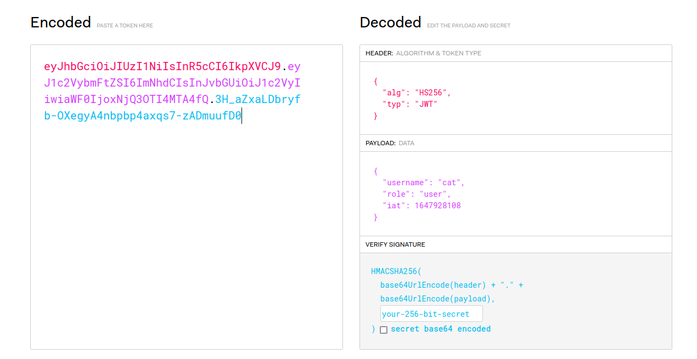
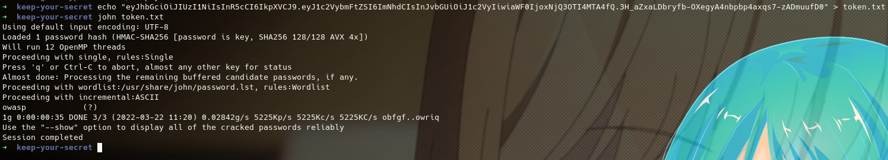
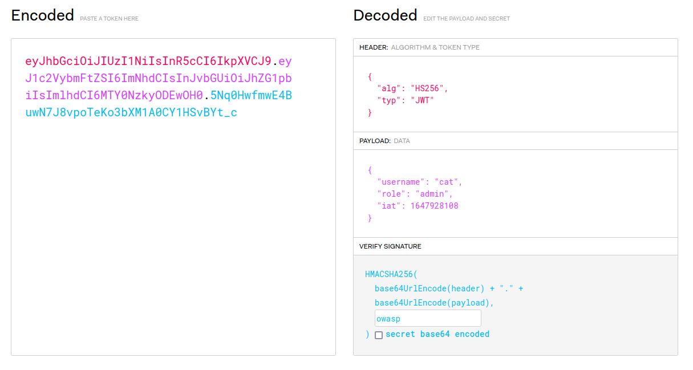
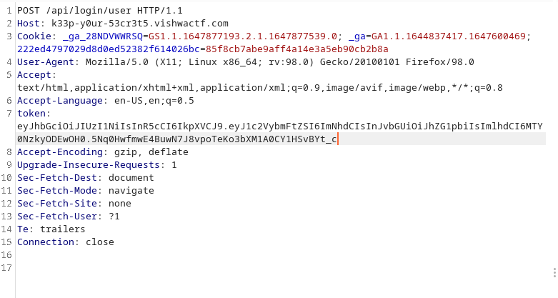
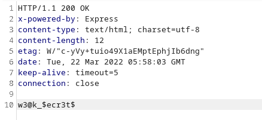

# Keep Your Secrets

In this challenge we need to register a user by `/api/signup/cat` and they give us a jwt token

We paste this token in https://jwt.io To see whats the decoded content

As the statement says we can only make the request to `/api/login/user` if we are an admin.\

I started to crack the jwt token with john and luckily it was able to crack it and get the secret.

Secret is `owasp`

Now we create a new jwt token with the key and role as admin.

We are almost done now do a POST request to `/api/login/user` with header token with value our jwt.

