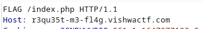
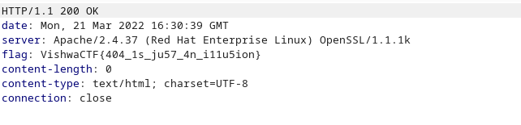

# Request Me Flag

After visiting the website we are presented a page 404.php.\
I tried visiting index.php it redirected me to 404.php again.

The description says

```
Somebody hosted this website having flag in it. Just request the FLAG to them maybe they will give you.
```

In the description they say `just Request the FLAG`.\
So I thought of changing the GET request on index.php to FLAG

I setup everyone's favorite tool burpsuite and ...



And the response


