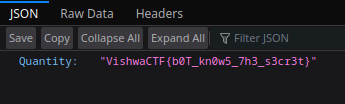

# Stock Bot

In this challenge there is a chat bot\
If we check the source there is a hint

```js
// Hint: Along with other products the Flag is also available in the Products directory
function sendMsg() {
  var msg = document.querySelector("#input-msg").value;
  document.querySelector("#input-msg").value = "";
  div = document.querySelector(".chat-body");
  div.innerHTML +=
    "<div id='user-chat' class='user-div'><p class='user-msg msg'>" +
    msg +
    "</p></div>";
  div.scrollTop = div.scrollHeight;
  if (!msg.includes("Flag")) {
    async function fetchDataAsync(url) {
      try {
        const response = await fetch(url);
        obj = await response.json();
        div.innerHTML +=
          "<div class='bot-div'><p class='bot-msg msg'>" +
          obj["Quantity"] +
          "</p></div>";
      } catch (error) {
        div.innerHTML +=
          "<div class='bot-div'><p class='bot-msg msg'>No such product</p></div>";
      }
      div.scrollTop = div.scrollHeight;
    }
    fetchDataAsync("/Products/check.php?product=" + msg);
  } else {
    div.innerHTML +=
      "<div class='bot-div'><p class='bot-msg msg'>No such product</p></div>";
    div.scrollTop = div.scrollHeight;
  }
}
```

If we look closely there is a if condition where it checks if the message has `Flag` init that means if we request to

```
/Product/check.php?product=Flag
```

We should get the flag



There we have it
